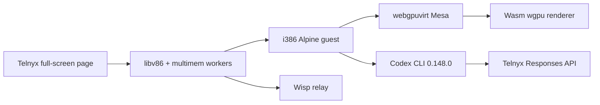

# Telnyx Experience appliance

The Telnyx Experience is a production-shaped v86 deployment of the four-vCPU Ghostty/Codex appliance. Its canonical source is `telnyx-experience/`; browser runtime, image, and snapshot outputs remain in their normal repository locations.

## Data flow



`telnyx-experience/index.html` imports `build/libv86.mjs` and `src/browser/ready_state_snapshot.js`. Worker mode loads `build/v86-multimem.wasm`, `build/gram*.wasm`, and `src/browser/vcpu_worker.js`. The guest mounts the versioned flat-file image over 9p. VirtIO GPU commands cross into the independent Rust/Wasm renderer under `build/virtio-gpu-wgpu/`.

The experience uses one canonical copy of every runtime asset. A separate checkout may symlink `telnyx-experience/`, but must not retain copied `build`, `bios`, `src`, or `images` trees.

## Source ownership

| Path | Contract |
|---|---|
| `telnyx-experience/index.html` | Branded loader, snapshot restore, fixed runtime defaults, responsive handoff. |
| `telnyx-experience/server.py` | Cross-origin-isolated HTTP/TLS serving and cache policy. |
| `tools/docker/virtio-gpu-multi-core-alpine-codex/telnyx/` | Codex binary overlay, Telnyx config/catalog, checksums, versioned image build. |
| `tests/browser/virtio_gpu_codex_acceptance.js` | Shared capture/restore and GPU/browser acceptance; `V86_CODEX_BROWSER_PAGE` selects the branded entry point. |
| `images/virtio-gpu-multi-core-alpine-codex-telnyx-v0.148.0-*` | Ignored rootfs, flat-file image, contract, and hosted snapshot. |

The image is based on the existing multi-core Codex appliance. The Telnyx overlay replaces the older Codex binary with the locally packaged static i386 0.148.0 build and installs the provider configuration and model catalog. It does not change the no-autostart policy: Ghostty opens a shell, and the user starts `codex` manually.

## Initial setup

1. Install the v86 dependencies from the root README, Docker with `linux/386` support, Python `zstandard`, Rust `wasm32-unknown-unknown`, and `wasm-bindgen`.
2. Place the `codex-i386-agent` checkout beside v86, or set `CODEX_I386_DIST`.
3. Produce `codex-rust-v0.148.0-i386-alpine-3.24.tar.gz`:

   ```sh
   cd ../codex-i386-agent
   UPSTREAM_TAG="$(cat .github/i386/upstream-version)" .github/i386/build.sh
   cd ../v86
   ```

4. Build all canonical inputs:

   ```sh
   make telnyx-experience-build
   ```

The host and container both verify the Codex archive against `telnyx/artifacts.lock`. The container also checks the upstream tag and `codex-cli 0.148.0` version before exporting the rootfs.

## Image build

```sh
make virtio-gpu-multi-core-alpine-codex-telnyx-image
```

The target builds the standard Codex fixture, adds the multi-core readiness layer, then applies the Telnyx overlay. It emits a distinct versioned namespace:

```text
images/virtio-gpu-multi-core-alpine-codex-telnyx-v0.148.0-rootfs.tar
images/virtio-gpu-multi-core-alpine-codex-telnyx-v0.148.0-rootfs-flat/
images/virtio-gpu-multi-core-alpine-codex-telnyx-v0.148.0-fs.json
images/virtio-gpu-multi-core-alpine-codex-telnyx-v0.148.0-image-contract.json
```

Do not rename these to the generic multi-core prefix. Multiple fixture variants share `images/`, so distinct names prevent one build from silently replacing another.

## Guest configuration

The committed config selects:

```toml
model = "moonshotai/Kimi-K2.6"
model_provider = "telnyx"
model_catalog_json = "/home/codex/.codex/model-catalogs/telnyx.json"
```

The provider uses the Responses wire API at `https://api.telnyx.com/v2/ai/openai` and reads `TELNYX_API_KEY`. The image and snapshot contain no API key. Provision the variable in the live terminal only, then invoke `codex`.

The Telnyx MCP server definition is installed but disabled. Codex Apps and browser-, computer-, image-, and multi-agent features remain disabled. This preserves the appliance rule that no host-owned tool catalog or automatic MCP service is introduced.

## Snapshot build

Capture through the shared browser harness:

```sh
make telnyx-experience-snapshot \
    TELNYX_RELAY_URL='wisps://your-relay.example/wisp/path/'
```

The guest pauses at the pre-Ghostty checkpoint only after architecture, UID, hostname, kernel, loopback, network, Xorg, Openbox, Codex version, worker-vCPU parallelism, and zero-live-3D-resource checks pass. The harness stops the emulator, saves state, compresses it, writes a fingerprinted `.bin.zst`, and updates the JSON manifest.

Never capture after setting `TELNYX_API_KEY`. Snapshot outputs are ignored and deployment-specific. The compatibility fingerprint covers the runtime assets and configuration; a stale or corrupt snapshot is rejected and the page cold-boots instead.

Restore acceptance uses the actual branded page:

```sh
make telnyx-experience-test \
    TELNYX_RELAY_URL='wisps://your-relay.example/wisp/path/'
```

Expected evidence includes worker execution with four effective vCPUs, `webgpuvirt (v86 WebGPU)`, loopback/network pass markers, Codex no-autostart/full-access markers, a visible changing canvas, valid mixed-alpha cursor pixels, and zero browser/WebGPU/backend errors.

## Loader and viewport handoff

The boot overlay displays the plain ASCII Telnyx mark. Progress is derived from completed asset fetches, snapshot bytes, emulator lifecycle events, and serial readiness markers. There is no synthetic timer path.

At readiness, the overlay is removed rather than left as a transparent compositor layer. The guest keeps its native 1920×1080 scanout and renders Ghostty at 20 points; the page applies one uniform CSS transform using the larger viewport-to-canvas scale. This preserves Ghostty glyph proportions at every browser zoom level and crops only the dimension that overflows the viewport.

## Serving and deployment

Local canonical server:

```sh
make telnyx-experience-serve
# http://127.0.0.1:8082/
```

Direct TLS:

```sh
python3 telnyx-experience/server.py \
    --host 0.0.0.0 --port 8443 \
    --certfile /path/fullchain.pem --keyfile /path/privkey.pem
```

The document must remain at `/telnyx-experience/index.html` (the server maps `/` there) so its `../build`, `../src`, `../bios`, and `../images` URLs resolve to repository-root assets. A reverse proxy must preserve COOP, COEP, and CORP headers; without cross-origin isolation, worker-vCPU startup fails because shared WebAssembly memory is unavailable.

Cache rules:

- root, HTML, and JSON: `no-cache`
- Wasm, compressed state, and flat rootfs objects: one year, immutable
- other runtime assets: one hour

The server disables directory listings and sets `nosniff` and `no-referrer`. HTTPS is mandatory outside localhost for clipboard and other secure-context APIs.

## Maintenance checklist

When changing the guest config, model catalog, Codex package, browser runtime, firmware, worker code, renderer, memory sizes, CPU topology, relay state, or snapshot command line:

1. Update the committed source or checksum pin.
2. Run `make telnyx-experience-build`.
3. Capture a fresh snapshot.
4. Run `make telnyx-experience-test`.
5. Serve the page at desktop and tall/mobile viewport sizes; verify the loader disappears and non-black Ghostty pixels remain visible.
6. Keep all generated `build/` and `images/` files uncommitted.

Operational details and credential handling are also documented in [`../telnyx-experience/README.md`](../telnyx-experience/README.md).
